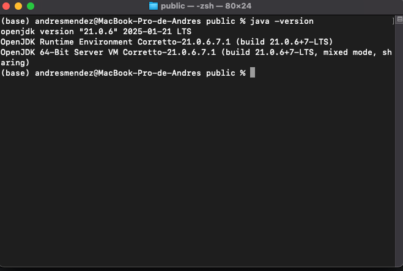
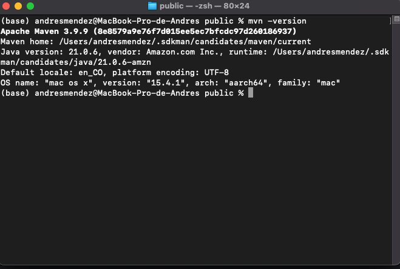
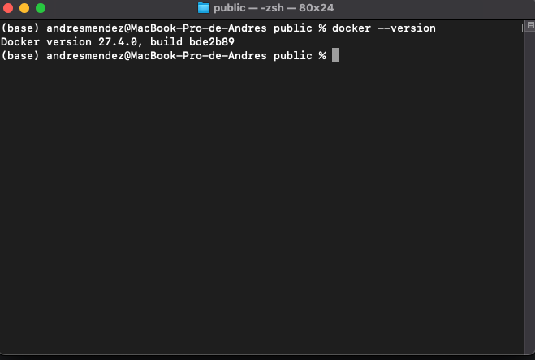

# ms-math

Project challenge

## Comenzando 🏁

_Proyecto CRUD de candidatos_

### Prerrequisitos 📋

* _Crear una cuenta de GitHub (opcional) -> [Registrar cuenta](https://github.com/join)_
* _Crear cuenta en Docker Hub (opcional) -> [Registrar cuenta](https://www.docker.com/products/docker-hub/)_
* _Docker -> [Descargar Docker](https://www.docker.com/products/docker-desktop/)_
* _JDK 21 -> [Descargar JDK 21](https://docs.aws.amazon.com/corretto/latest/corretto-21-ug/downloads-list.html)_
* _Maven -> [Descargar Maven](https://maven.apache.org/download.cgi)_
* _Liquibase -> [Ver Documentación](https://docs.liquibase.com/tools-integrations/maven/getting-started-liquibase-maven.html)_
* _Junit_
* _Mockito_
* _OpenApi - Swagger_
* _Postgres_
* _Intellij_

## Instalación y configuración 🔧

### Java

_**1**. Para la primera instancia necesitaremos confirmar que la versión de JDK este correctamente instalada._

```
java -version
```


### Maven

_**2**. Validar versión de maven._

```
mvn -version
```


### Docker

_**3**. Validar versión de docker._

```
docker --version
```


## Compilación y despliegue ⚙️ 🚀

Ubicarse en la carpeta del proyecto

```
/ms-math
```

Compilación de proyecto en Java

```
mvn clean install -DskipTests
```

Construcción de imagen a nivel de docker

```
docker compose build
```

Despliegue de proyecto

```
docker compose up
```

## Documentación Swagger 📚

* _Swagger Ui -> [Ver](http://localhost:8080/math-ms/swagger-ui/index.html#/)_


